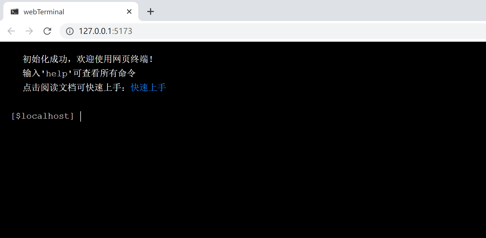
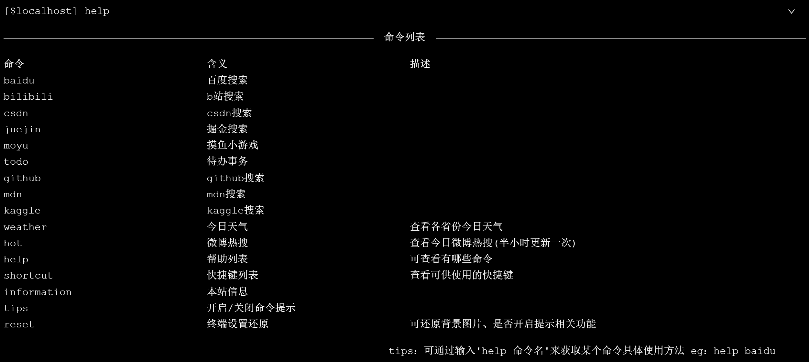
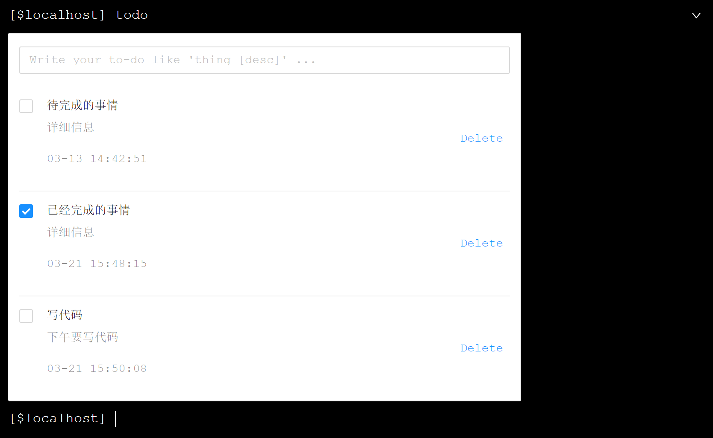
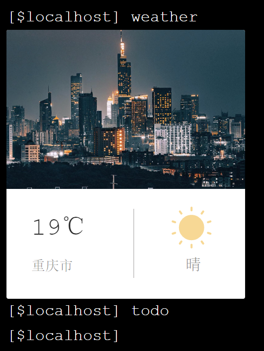
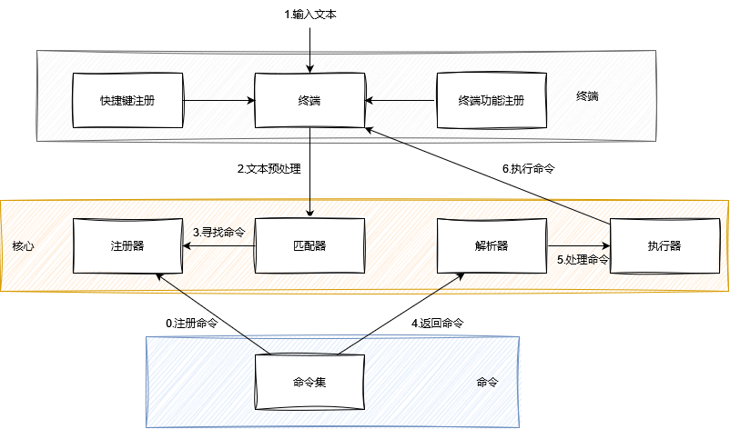

# webTerminal

## 什么是webTerminal？

​		webTerminal是一个基于Vue3技术开发一个的极客范浏览器主页。它在浏览器中模拟一个命令行界面，并提供类似于Linux系统的命令行工具。用户可以在其输入命令方便快捷的使用浏览器的常用功能，让用户在一个页面就可高效完成各种功能，给用户提供了一种全新的浏览器体验。

## 部分功能展示

## 快速上手

打开网站

输入help查看所有支持的命令

输入help 命令查看单个命令的使用方法

输入shortcut查看可供使用的快捷键

> 命令详细用法请参考  [命令手册]()

输入命令开启您的探索之旅

## 优势

- 多功能化：

  ​    集搜索，天气，游戏等功能为一体，通过输入命令的方式来减少鼠标的使用

- 高效率：

  ​    单页面集成多功能，在一个平台上就可完成各种任务；支持快捷键和命令提示功能，提高了用户使用效率

- 极简化：

  ​    仿Linux的终端设计风格将页面元素精简到最少，让用户可以更加集中的关注主要内容；单页面操作，避免了多页面切换所带来的繁琐，提高用户体验感

- 可拓展性：

  ​    规范化、组件化、模块化的设计让此平台具有很好的可拓展性，可以根据用户的需求和反馈不断添加新的功能模块和优化现有功能

## 目前已支持的命令

- 搜索相关
  - 百度          baidu  <搜索内容>
  - b站           bilibili  <搜索内容>
  - csdn          csdn  <搜索内容>
  - 掘金          juejin  <搜索内容>
  - GitHub          github  <搜索内容>
  - MDN          mdn  <搜索内容>
  - kaggle          kaggle  <搜索内容>

- 实用功能相关
  - 今日天气          weather  <子命令>
  - 微博热搜          hot
  - 待办事项          todolist
  - 摸鱼小游戏          moyu

- 终端功能相关
  - 开启＼关闭命令提示          tips
  - 终端设置还原          reset

- 信息相关
  - 本站信息          info
  - 命令列表          help  <子命令>
  - 快捷键列表          shortcut

## 技术栈

### 前端

- 主要技术：

  - Vue 3

  - Vite 2

  - Pinia 2 状态管理

  - TypeScript 类型控制

  - Eslint 代码规范控制

  - Prettier 美化代码

- 依赖库：

  - axios 网络请求

  - dayjs 时间处理

  - lodash 工具库

  - getopts 命令参数解析

- 依赖服务：

  - 高德地图  天气 API

  - 天行数据  微博热搜榜 API

- 其他

  - 组件库：AntDesign
  - 图标字体库：iconfont

### 后端

- 待补充....

## 系统设计

### 终端

- 输入：常驻input框，接收用户输入的命令，绑定事件监视命令的提交
- 输出：折叠面板，展示用户命令及当前命令执行结果，可设置折叠或收起
  - 命令类型：输入命令 + 结果
  - 文本类型：单行文本展示
  - 组件类型：输出要展示的组件

- 快捷键：监视键盘事件，全局触发
- 命令提示：根据用户输入内容动态匹配，给出提示
- 开放接口：向下游开放终端功能，如input聚焦，清屏等

### 核心

- 注册器：命令集向上注册命令，生成命令表（map），便于匹配器快速查找
- 匹配器：根据输入内容查找命令，向解析器发送源命令

- 解析器：处理源命令的操作选项和参数，便于下游执行器执行命令
- 执行器：执行命令，完成操作

### 命令

- 命令集：存储所有可用命令

