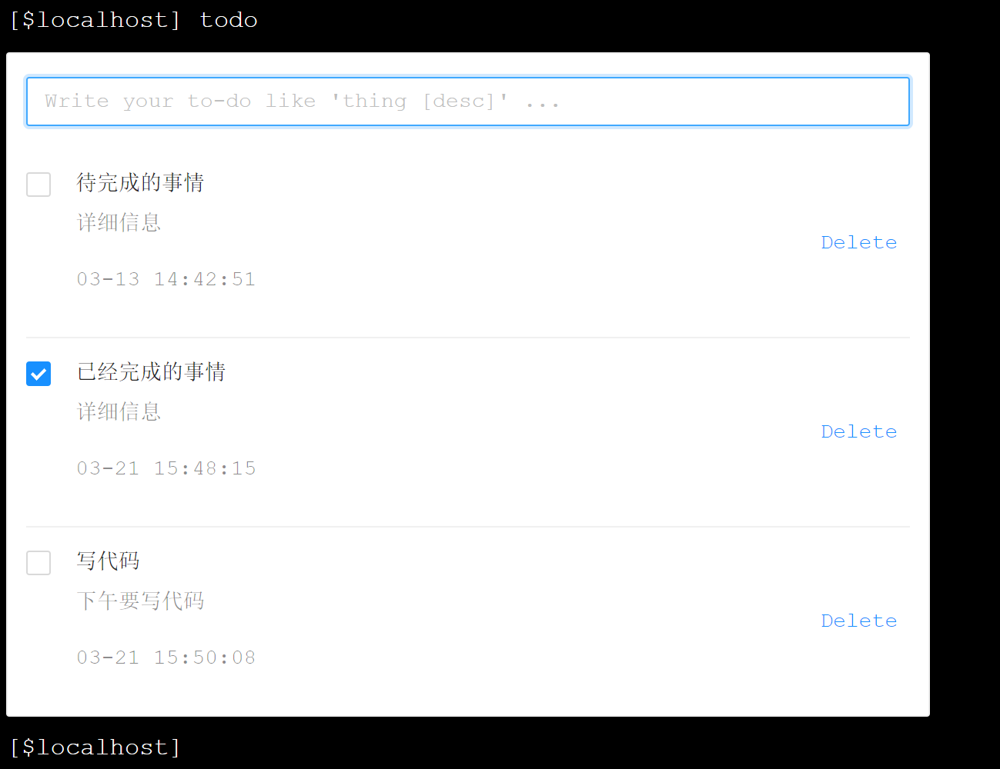
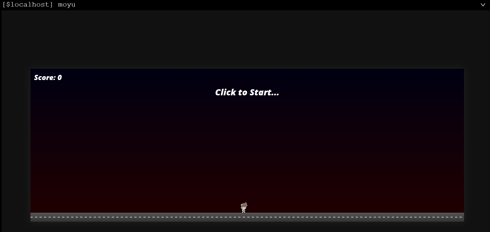
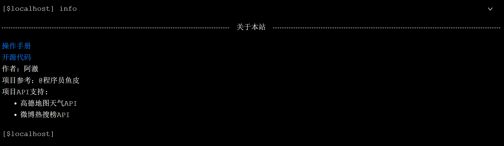
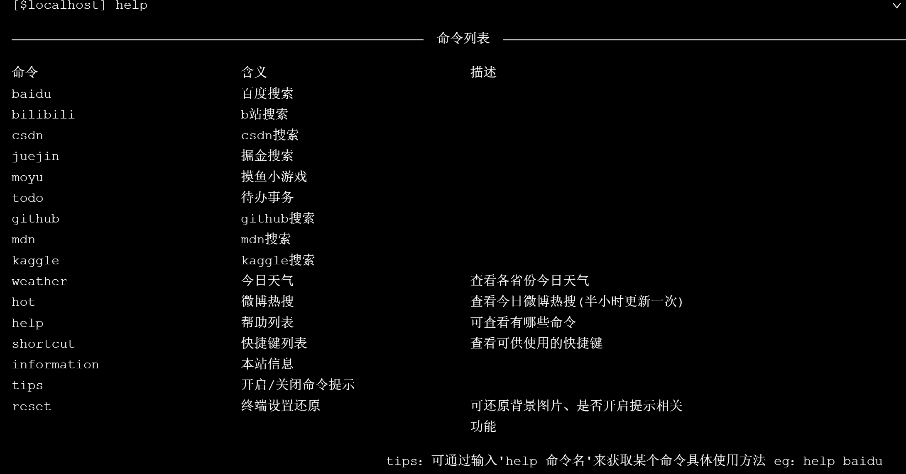

# webTerminal命令手册

在这里你可以查看本终端所支持的所有命令及详细用法。

其中，用 `<> `表示的参数是必选，用 `[]` 表示可选参数

## 搜索相关

### 百度搜索

在百度上进行搜索操作

- 命令行：

  ```
  baidu <搜索内容> [-s 在当前页面打开] [-p 搜索的是否是图片]
  ```

- 命令选项：

  - -s    是否在当前页面打开

    下述命令行表示在当前页面打开百度搜索 helloWorld

    ```
    baidu -s helloWorld 
    ```

  - -p    是否搜索图片

    下述命令行表示用百度图片搜索 flower

    ```
    baidu -p flower 
    ```

  - 命令选项可多选，且支持后置，例如：

    下述命令行表示在当前页面打开百度图片搜索 helloWorld

    ```
    baidu helloWorld -s -p
    ```

### Bilibili搜索

在线观看bilibili视频

- 命令行：

  ```
  bilibili <搜索内容> [-s 在当前页面打开] [-b 通过b站视频id在当前页面播放视频]
  ```

- 命令别名：

  - ```
    bzhan <搜索内容>
    ```

  - ```
    bili <搜索内容>
    ```

- 命令选项：

  - -s    是否在当前页面打开

    ```
    bilibili -s helloWorld 
    ```

  - -b 通过b站视频id在当前页面播放视频

    下述命令行表示在当前页面播放BV号为15b41157i4的视频

    ```
    bilibili -b BV15b41157i4
    ```

### CSDN搜索

在CSDN上进行搜索操作

- 命令行：

  ```
  csdn <搜索内容> [-s 在当前页面打开]
  ```

- 命令选项：

  - -s    是否在当前页面打开

    下述命令行表示在当前页面打开 CSDN 搜索 vue

    ```
    csdn -s vue
    ```

### 掘金搜索

在掘金上进行搜索操作

- 命令行：

  ```
  juejin <搜索内容> [-s 在当前页面打开]
  ```

- 命令选项：

  - -s    是否在当前页面打开

    下述命令行表示在当前页面用稀土掘金平台搜索 vue

    ```
    juejin -s vue
    ```

### GitHub搜索

在掘金上进行搜索操作

- 命令行：

  ```
  github <搜索内容> [-s 在当前页面打开]
  ```

- 命令别名

  - ```
    git <搜索内容>
    ```

- 命令选项：

  - -s    是否在当前页面打开

    下述命令行表示在当前页面用稀土掘金平台搜索 vue

    ```
    github -s vue
    ```

### MDN搜索

在 MDN 上进行搜索操作

- 命令行：

  ```
  mdn <搜索内容> [-s 在当前页面打开]
  ```

- 命令选项：

  - -s    是否在当前页面打开

    下述命令行表示在当前页面用 mdn 搜索 splice 函数

    ```
    mdn -s splice
    ```

### Kaggle搜索

在 kaggle 上进行搜索操作

- 命令行：

  ```
  kaggle <搜索内容> [-s 在当前页面打开]
  ```

- 命令选项：

  - -s    是否在当前页面打开

    下述命令行表示在当前页面用 kaggle 搜索 机器学习

    ```
    mdn -s 机器学习
    ```

## 实用功能相关

### 今日天气

查看全国各省份今日天气、温度情况

- 命令行：

  ```
  weather [子命令]
  ```

- 命令别名

  - ```
    tianqi [子命令]
    ```

  - ```
    wendu [子命令]
    ```

- 子命令

  设置想要查看天气的省份

  - 命令行：

    ```
    weather loc -c <省份名>
    ```

  - 效果图

    

> 注意，该命令只能用于查看中国的省份，并不能查看具体城市，也不能后置参数
>
> 

### 微博热搜榜

查看今日微博实时热搜

- 命令行：

  ```
  hot
  ```

- 效果图

  

### 待办事项

快速写入代办事项

- 命令行

  ```
  todo
  ```

- 效果图

  

### 摸鱼小游戏

支持一些H5小游戏，游戏方式随机

- 命令行：

  ```
  moyu
  ```

- 效果图

  

## 终端功能相关

### 开启＼关闭命令提示

- 命令行：

  ```
  tips
  ```

- 默认开启命令提示，设置后需刷新页面

### 终端设置还原

还原终端默认设置

- 命令行：

  ```
  reset
  ```

## 信息相关

### 本站信息

显示出本站基本信息

- 命令行：

  ```
  info
  ```

- 效果图

  

### 命令列表

显示出本站目前支持的命令及用法

- 命令行

  ```
  help [子命令]
  ```

- 子命令

  可选，若选择可查看特定命令，不选则打印命令列表

  - 用法：

    ```
    help [命令名]
    ```

    例如：下述命令行查看baidu命令的信息

    ```
    help baidu
    ```

  - 效果图

    
  

### 快捷键列表

显示出本站提供的快捷键

- 命令行

  ```
  shortcut
  ```

- 效果图

  
